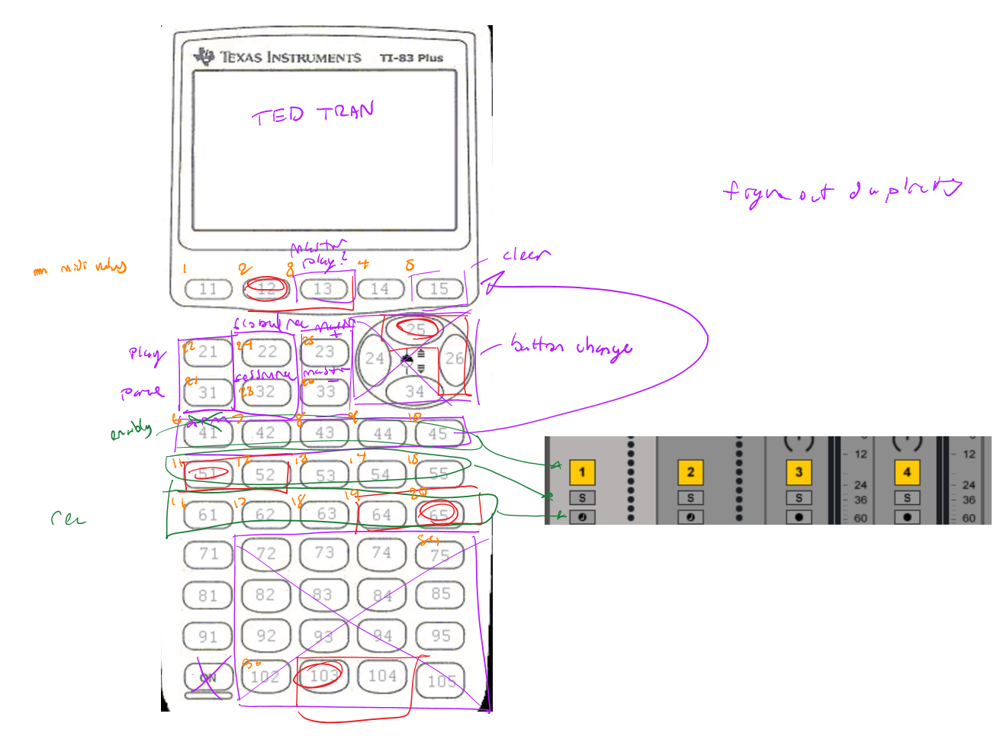
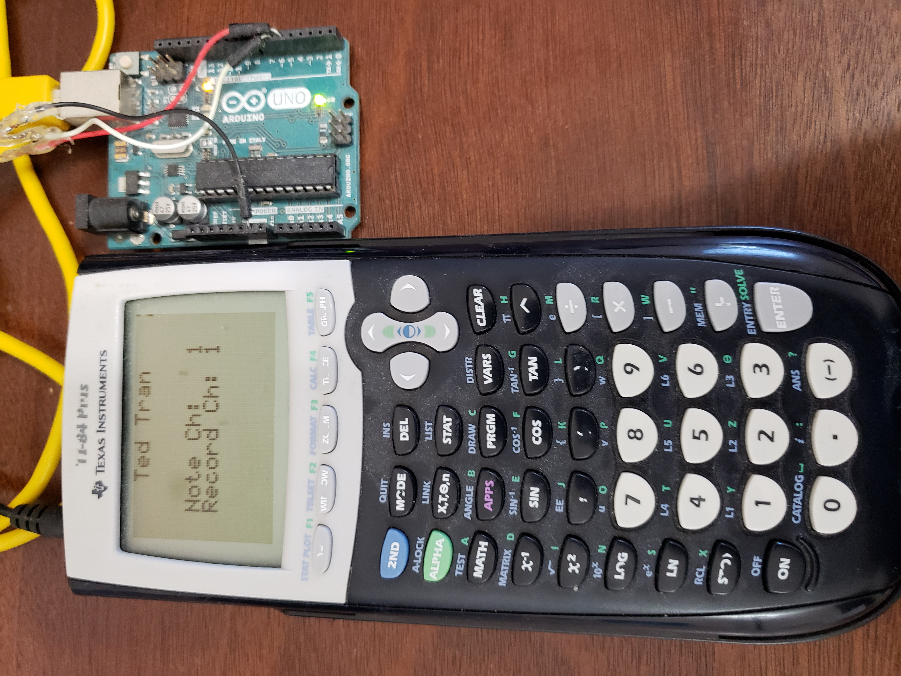

# calculator_clock_fan
This was one of the largest projects I've ever done in Arduino. This is compiled of 3 different MIDI devices.

It uses a TI calculator as a beat machine whenever one of the numbers were pressed.
It uses the minute and hour hands on a clock as sensors to convert to MIDI output as well. 
And it also uses a regular computer fan as a sensor that can calculate the RPM of the fan which then uses the calculation that is made translates to different kinds of MIDI output.

## notes
As seen in a photo below, I added the ability to press the up and down arrow keys to change the note channel. Doing this would change the range of MIDI notes played. Note channel 1 plays notes 36 to 51 on the keyboard, while note channel 1 plays notes 52 through 67 and so on.
There are also several other buttons mapped to the calculator keyboard as well.

The clock is played in a different manner. One hand acts as the trigger for MIDI notes while the other hand acts as the selection mechanism for which sequence of notes are to be played. The trigger hand on the clock woud only trigger a note from hour ticks one through six, and it would only trigger when the clock hand moves clockwise. If I move the clock hand counterclockwise, no trigger output would be made. 

The computer fan was less of an instrument and more of a knob. Whenever I slowed the movement of the fan RPM, it would slow and pitch down the sample being played on the calculator. So in a way, the clock and fan are bundled together into the same instrument. 

There should be a video I post here. I forgot to take a lot of photos.

### **[VIDEO of the final project in action](https://drive.google.com/file/d/16bdbqqDCwxRX-Vt-3ip4HXEvBS_aFvhs/view?usp=sharing)**

*design notes*

*initial stage with just the calculator*

